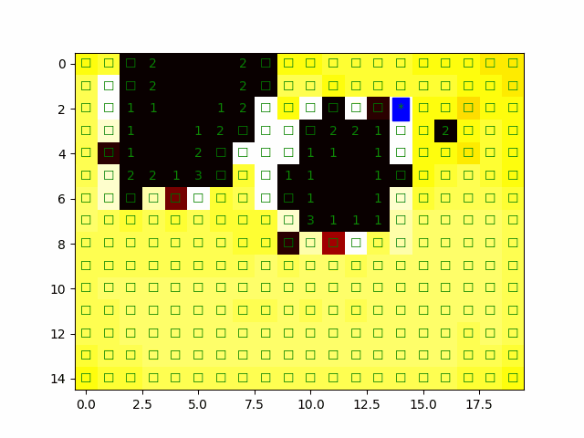

# minesweeper-ai



Here I am trying to train AI to play Minesweeper.

I also included a working implementation of Minesweeper game using Tkinter GUI package.

To play the game, run `python src/game.py`

The Player AI is implemented in the `src/Minesweeper_Conv.ipynb` notebook.

### Files:
* `engine.py` - The business logic of the game.
* `game.py` - GUI for playing it (requires `tkinter` package)
* `ml_dataset.py` - Helper functions and classes for generating training datasets for our ML model.
* `Minesweeper_Conv.ipynb` - Notebook with the model definition and the training loop.

## Dataset

Each of our training samples is a partially opened game board where numbers `0-8` are stored in each open position and `10` indicates hidden positions.

For example:
```
[[10, 10, 10, 10, 10, 10, 10, 10, 10, 10],
 [10, 10, 10, 10, 10, 10, 10, 10, 10, 10],
 [ 1, 10, 10,  5, 10, 10, 10, 10, 10, 10],
 [10, 10, 10, 10, 10, 10, 10, 10, 10, 10],
 [10, 10, 10, 10,  4, 10, 10, 10, 10, 10],
 [10, 10, 10, 10, 10, 10, 10,  3,  1,  1],
 [10, 10, 10, 10, 10, 10, 10,  2,  0,  0],
 [10, 10, 10, 10, 10, 10, 10,  2,  0,  0],
 [10, 10, 10, 10,  3,  3,  3,  3,  2,  1],
 [10, 10, 10, 10,  1,  0,  1, 10, 10, 10],
 [10, 10, 10, 10,  2,  2,  3, 10, 10, 10],
 [10, 10,  1, 10, 10, 10, 10, 10, 10, 10]]
```
is a tensor representation of the following board:
```
☐ ☐ ☐ ☐ ☐ ☐ ☐ ☐ ☐ ☐
1 ☐ ☐ 5 ☐ ☐ ☐ ☐ ☐ ☐
☐ ☐ ☐ ☐ ☐ ☐ ☐ ☐ ☐ ☐
☐ ☐ ☐ ☐ 4 ☐ ☐ ☐ ☐ ☐
☐ ☐ ☐ ☐ ☐ ☐ ☐ 3 1 1
☐ ☐ ☐ ☐ ☐ ☐ ☐ 2    
☐ ☐ ☐ ☐ ☐ ☐ ☐ 2    
☐ ☐ ☐ ☐ 3 3 3 3 2 1
☐ ☐ ☐ ☐ 1   1 ☐ ☐ ☐
☐ ☐ ☐ ☐ 2 2 3 ☐ ☐ ☐
☐ ☐ 1 ☐ ☐ ☐ ☐ ☐ ☐ ☐
```

Labels are stored as a matrix where `1` is a position with a mine, `0` is a position without mine, and `-100` if the cell is open (`cell_value != 10` in the input tensor). Note that `-100` is a special value for `F.cross_entropy()` that tells it not to compute loss in that cell (because it's open already and its value is known via the input).

For example:
```
[[   0,    0,    0,    1,    0,    0,    0,    1,    1,    0],
 [   0,    0,    0,    1,    0,    0,    0,    1,    0,    1],
 [-100,    0,    0, -100,    1,    0,    0,    0,    0,    1],
 [   1,    0,    1,    1,    1,    1,    1,    1,    1,    1],
 [   0,    1,    0,    1, -100,    0,    1,    0,    1,    0],
 [   0,    1,    0,    0,    0,    0,    0, -100, -100, -100],
 [   1,    1,    0,    0,    1,    0,    1, -100, -100, -100],
 [   0,    0,    1,    0,    1,    1,    1, -100, -100, -100],
 [   0,    0,    1,    0, -100, -100, -100, -100, -100, -100],
 [   0,    1,    0,    1, -100, -100, -100,    1,    1,    0],
 [   1,    0,    1,    0, -100, -100, -100,    0,    0,    0],
 [   0,    0, -100,    0,    0,    1,    1,    0,    1,    0]]
```
